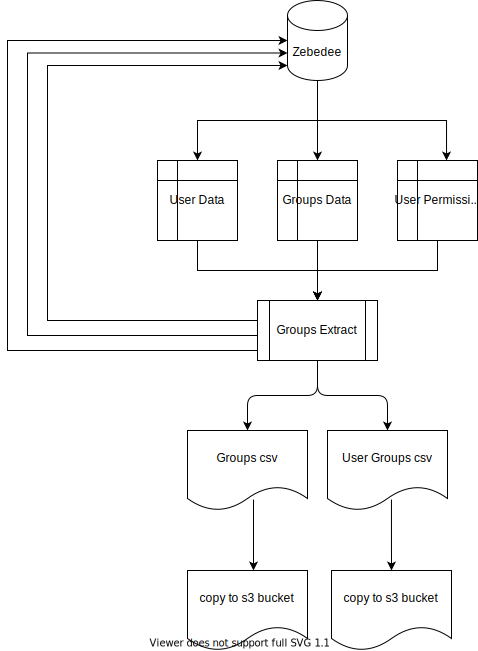

#dp-identity-api Zebedee Group Migration
## Description

When we put the new auth service live we will need to migrate all groups from the existing login mechanism (zebedee) to the new identity API. In order to do this we will need a scripted and reliable approach to exporting the groups and the list of members of those groups from zebedee.

##What
Investigate best approach to export all groups and their list of users from zebedee ready for import into Cognito
There is a GET /teams endpoint on zebedee that lists all the teams and their members
We could also consider loading from the /var/florence/zebedee/teams directory where the JSON files have the same info
The script needs to output to things:
1. A list of all groups
2. A list of users and for each user a list of groups they are in
    for each user extract their current permissions
    (Due to complex structure proposed a single record for csv output is being created for each user and group/permission)



## Solution 
###Requirements 
1.  see go.mod 
2.  dp-cli access to required environment
3.  florence/zebedee user and password for the required environment

###Set Up and Execution
two terminal windows are required  one for the tunnel, another to run extracts 
1. Set Up and Run Tunnel
    If using localhost start the apps required to run local florence/zebedee (There is no need to start tunnel).
    If using an remote environment version
    ```shell
    dp remote allow <environment>
    dp ssh develop publishing 1 -p 10050:10050
    ```
3. In the other Terminal Widow 
    Set the require  Environmental Variables :-
    ``` shell 
    export zebedee_user=<zebedee user email>
    export zebedee_pword=<zebedee user password for environment>
    export zebedee_host=\<local "http://localhost:8082"; otherwise "http://localhost:10050">
    export groups_filename=<full path to file>
    export groupusers_filename=<full path to file>

4. Run the code....
   ``` shell
   go run dp-identity-data-migration/groupsdataextraction/group_extraction.go
   ```

### Output
#### in Terminal 
```
=========  ... groups.csv file validiation =============
Expected row count: -  14
Actual row count: -  14
csv Errors  <nil>
=========
...
{zebedee prints to terminal the list of users}
...
---
viewer@ons.gov.uk is not a user??? (these team members are not in the zebedee user list and not included in the migration)
---
=========  ...usergroups.csv file validiation =============
Expected row count: -  108
Actual row count: -  108
csv Errors  <nil>
=========
```

####Files
This script creates 2 csv files 
####groups csv 
group_name | user_pool_id | description | role_arn | precedence | last_modified_date | creation_date
--- | --- | --- | --- | --- | --- | ---
zebedee group ID | empty | zebedee group name | empty | default value 10 | empty | empty 

####usergroup csv
ser_name | group_name
--- | ---
user email | group or role names (comma separated list as string)


**Note** *don't forget to unset the environmental variables that had been set*

