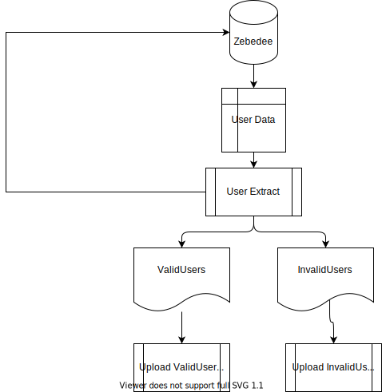

#dp-identity-api Zebedee User Migration
## Description

When we put the new auth service live we will need to migrate all users from the existing login mechanism (zebedee) to the new identity API. In order to do this we will need a scripted and reliable approach to exporting the users from zebedee.

##What
Investigate export of all users and transformation to the format required here: Creating the User Import .csv File - Amazon Cognito
We should likely validate the users' emails are @ons.gov.uk or @ext.ons.gov.uk emails and write these out to a separate list for admin review (but this is more of an implementation detail than spike one)
We are going to need to split the names to first and last as best as we can (does not need to be perfect as admin can fix any issues later, but we should consider if the email field can help with this at all) (but again this is probably more of an implementation detail)



## Solution 
###Requirements 
1.  dp-cli access to required environment
2.  florence/zebedee user and password for the required environment

###Set Up and Execution
two terminal windows are required  one for the tunnel, another to run extracts 
<ENVIRONMENT {localhost, develop, development, prod}>
1. Set Up and Run Tunnel
    If using localhost start the apps required to run local florence/zebedee (There is no need to start tunnel).
    If using an remote environment version
    ```shell
    dp remote allow <ENVIRONMENT>
    dp ssh develop publishing 1 -p 10050:10050
    ```
2. In the other Terminal Widow 
    Set the require  Environmental Variables :-
    ``` shell 
    export environment=<ENVIRONMENT>
    if [ ${environment}="localhost" ]
        then
        export zebedee_host="http://localhost:8082" 
        export email_domains="gmail.com,ons.gov.uk,ext.ons.gov.uk,methods.co.uk"
    else 
        export zebedee_host="http://localhost:10050"
        export email_domains="ons.gov.uk,ext.ons.gov.uk"
        dp remote allow ${environment}
        dp ssh ${environment} publishing 1 -p 10050:10050
    fi

    export zebedee_user="<ZEBEDEE USER EMAIL>"
    export zebedee_pword="<PASSWORD FOR ABOVE USER>"
    
    export tmpfilepath="<fullpath for a temp file>"
    export filename="users_export_$(date '+%Y-%m-%d_%H_%M_%S').csv"
    export s3_bucket="ons-dp-develop-cognito-backup-poc"
    export s3_base_dir="${environment}"
    export s3_region="eu-west-1"

4. Run the code....
   ``` shell
   go run dp-identity-data-migration/userdataextraction/user_extraction.go
   ```

### Output
#### in Terminal 
```
This is for  localhost
========= file validiation =============
Expected row count: -  2
Valid users row count: -  1
Invalid users row count: -  1
=========
========= Uploading valid users file to S3 =============
file uploaded to, https://ons-dp-develop-cognito-backup-poc.s3.eu-west-1.amazonaws.com/localhost/users_export_2022-05-18_14_53_11.csv
file uploaded to, https://ons-dp-develop-cognito-backup-poc.s3.eu-west-1.amazonaws.com/localhost/invalid_users_export_2022-05-18_14_53_11.csv
========= Uploaded fules to S3 =============
```

####Files
This script creates 2 csv files one with users with valid emailIds and other with invalid users 
#### csv file format 
cognito:username | name | given_name | family_name | middle_name | nickname | preferred_username | profile	picture | website | email | email_verified | gender | birthdate | zoneinfo | locale | phone_number | phone_number_verified | address | updated_at | cognito:mfa_enabled
--- | --- | --- | --- | --- | --- | --- | --- | --- | --- | --- | --- | --- | --- | --- | --- | --- | --- | --- | ---
uudi | --- | from email if expected format | from email if expected format | --- | --- | --- | --- | --- | email | true | --- | --- | --- | --- | --- | false | --- | --- | false 


**Note** *don't forget to unset the environmental variables that had been set*
